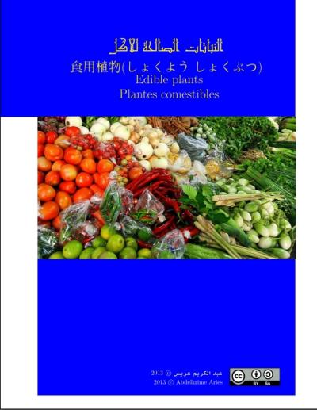

# Edible Plants book

A book designed to present different Edible plants classed as fruits, vegetables, cereals, etc.

It has the following purposes:
* To be as a Latex template for image books
* To educate children about different plants
* To afford the names of plants with many languages; currently: Arabic, Japanese, English, and French.

## versions

### Version 1
In its initial version, it is intended to be an image book to help translate different plants to many languages.

## License

Copyright (C) 2013  Abdelkrime Aries

This project has two different licenses: the LaTex code and the book itself.

### Latex Code License

This program is free software: you can redistribute it and/or modify
it under the terms of the GNU General Public License as published by
the Free Software Foundation, either version 3 of the License, or
(at your option) any later version.

This program is distributed in the hope that it will be useful,
but WITHOUT ANY WARRANTY; without even the implied warranty of
MERCHANTABILITY or FITNESS FOR A PARTICULAR PURPOSE.  See the
GNU General Public License for more details.

You should have received a copy of the GNU General Public License
along with this program.  If not, see <http://www.gnu.org/licenses/>.

### Pictures and the book License

The book and artistic contents are licensed under
[Attribution-ShareAlike 4.0 International (CC BY-SA 4.0)](https://creativecommons.org/licenses/by-sa/4.0/)

**You are free to:**
* Share — copy and redistribute the material in any medium or format
* Adapt — remix, transform, and build upon the material for any purpose, even commercially.

The licensor cannot revoke these freedoms as long as you follow the license terms.

**Under the following terms:**
* Attribution — You must give appropriate credit, provide a link to the license, and indicate if changes were made. You may do so in any reasonable manner, but not in any way that suggests the licensor endorses you or your use.
* ShareAlike — If you remix, transform, or build upon the material, you must distribute your contributions under the same license as the original.
* No additional restrictions — You may not apply legal terms or technological measures that legally restrict others from doing anything the license permits.
